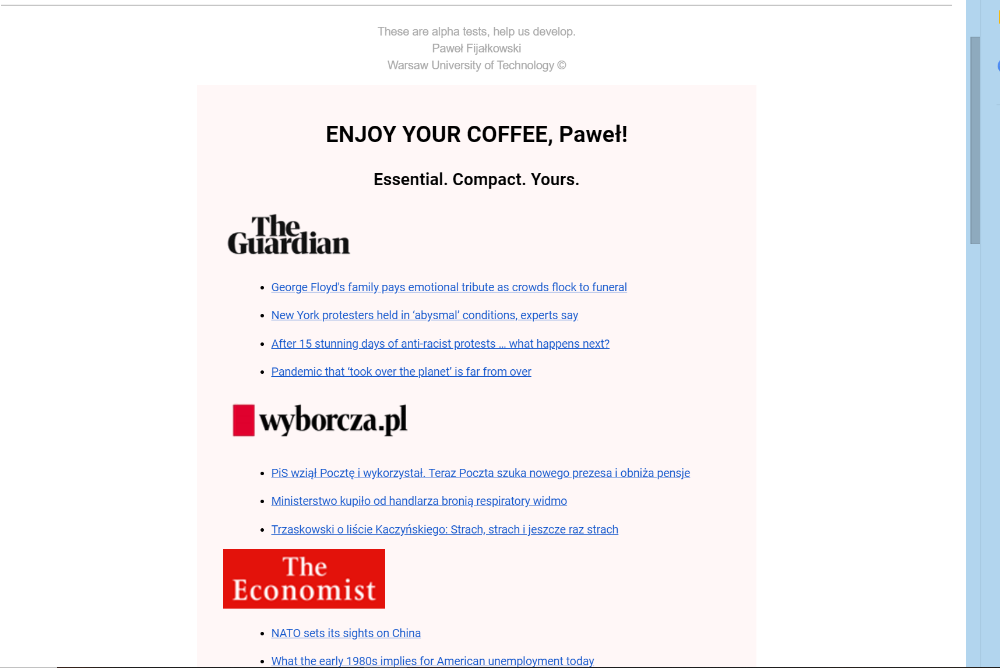

# personalised-press-mailing-service
## About
Engine webscraping articles from multiple websites.  
User choose his favourite newspapers and get personalised press briefieng every morning.  
## Technology
In order to achive this goal, I use multiple python packages like:
* BeautifulSoup (scraping)
* pymongo (atlas mongodb database of users)
* urllib.request (http request to sites)
* jinja2, markdown2 and email (creating, reading and compressing pretty html's)
* many many more
## Looks

## Author
Paweł Fijałkowski

Computer Science, University of Warsaw. (https://www.mimuw.edu.pl/)

Data Science, Warsaw University of Technology. (https://ww2.mini.pw.edu.pl/)

@mailto: fijalkowskipablo@gmail.com
